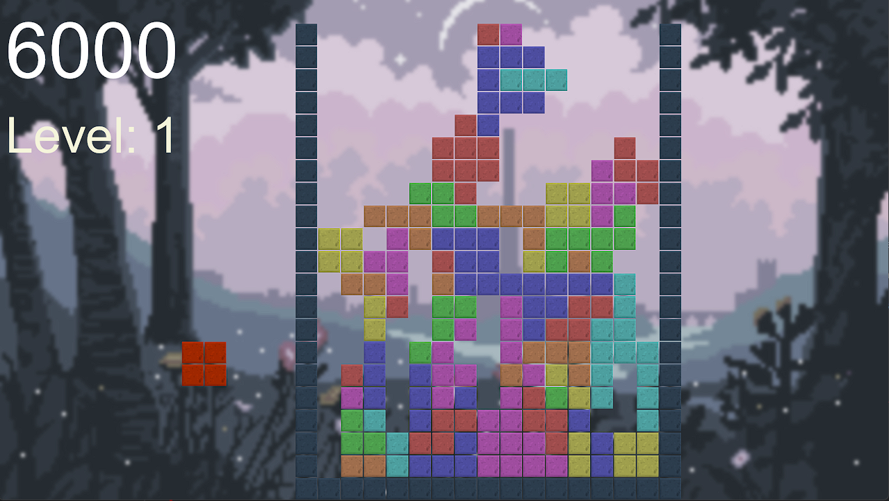

# Tetris in a day

It is what it says on the tin, Wolfengames and I wanted to try bevy so we spent an afternoon making tetris. Enjoy!

# Features!

We got:
- Tetrominoes drawn from a bag which is refreshed once one of each piece is drawn
- down arrow to make it go brrr
- space to jump down to the bottom
- colourful blocks
- clear row when full
- score and level display
- thing get faster as you clear more levels
- music
- FPS counter
- next piece preview
- overcomplicated level speedup curve that I definitely didn't spend way too much time working out the math for in the grand scheme of things...

We don't have:
- Fail state
- leaderboard
- neat code
- AMD GPU support...apparently

# License

Oh, and this is MIT in case you want to use my awful code
